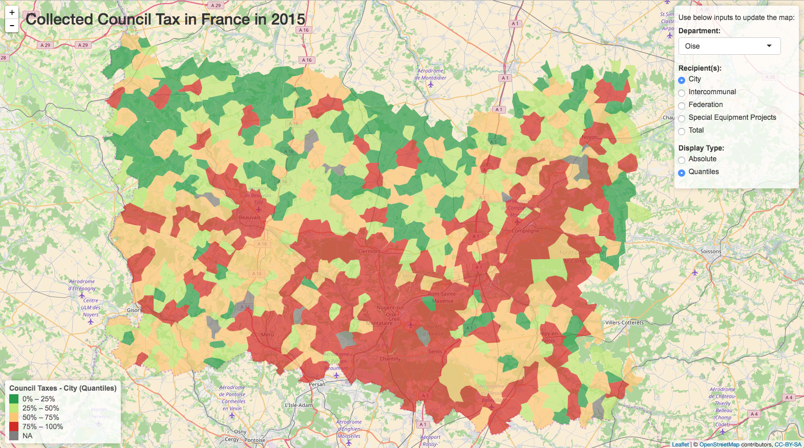

```{r setup, include=FALSE}
knitr::opts_chunk$set(echo = FALSE)
```

## Introduction

The aim of this application is to consult Council Taxes collected in each City by the French Government in 2015.

The User can use the following inputs to choose the data to display:

* **Department**: For performance reasons, data is displayed per department.
* **Recipient**: Council Taxes once collected are allocated to different recipients (Cities, Intercommunals, Federations, Special Equipment Projects)
* **Display Type**: "Absolute" for actual numbers and "Quantiles" for relative values compared to the distribution of all values.

## Data Sources
Two main data sources have been recounciled in this application:

* GIS data of each "Commune" (~ City) in France ([source](http://gadm.org/))
* Council Taxes of each "Commune" per Department ([source](http://www.impots.gouv.fr/portal/dgi/public/statistiques.donnees_detaillees;jsessionid=Q14F30Z1Z54E5QFIEIPSFFQ?espId=-4&pageId=stat_donnees_synthetiques&sfid=4502))

GIS data was retrieved using the `getData` function from the `raster` package.  

Council Tax data was (unfortunately) retrieved by manually downloading each Department file.

## Challenges

The main challenge has been to recouncil data from both data sources. In particular, matching "Commune" and Department names. The following cleaning rules have been applied:

* Trimming
* Transforming to upper case
* Replacing space and apostrophe characters by a dash
* Removing accents on characters
* Shortening some names to match both sources

Manipulating `SpacialPolygonsDataFrame` data type was also challenging especially when trying to enrich it with additional information (Council Tax amounts).


## Demo

<center>


[Click here to access app!!](https://slievain.shinyapps.io/impots_locaux/) 
<center>